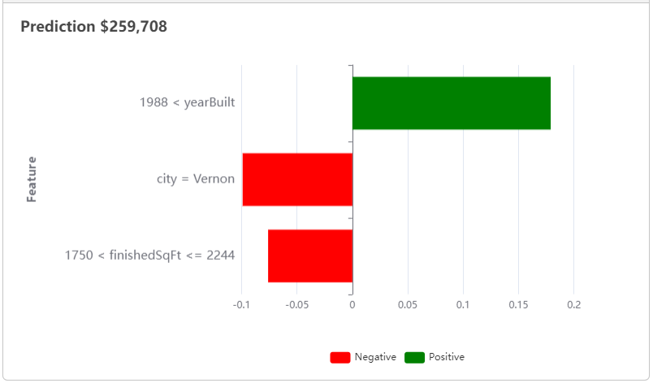

## LIME

The chart seen in the application is produced via a technique called **"LIME"**, which stands for "**L**ocal **I**nterpretable **M**odel-Agnostic **E**xplanations". The original paper citing the methodology can be found [here](https://arxiv.org/abs/1602.04938).

This techique fits a linear model through the given observation, then looks at the nearest (hence, "Local") data points around that particular observation to gauge how the model performs at those other points in the vicinity compared to the observation at hand.

## How do I Interpret the Chart?

The chart on the **App** page displays:

- The top three most influential variables in determining the model's output score for that observation
- The criteria that made that variable influential to the model output for that observation
- Whether or not that variable increased or decreased the model output value (sale price) for that observation
- The relative importance of each variable for determining the model's output score for that observation

### Example

A prediction for a house in **Vernon** with **2** Bathrooms, a Square Footage of **2100** and built in the year **2000** yields the following chart (Linear Regression):

We can interpret it as follows:

- The most important feature was the **"yearBuilt"** variable, specifically the fact that the home was built after 1988. In the case of this observation, this variable had a positive impact on the model output value (it increased the predicted sale price).
- The second-most important feature was the **"city"** variable, specifically the fact that the home was located in Vernon, Connecticut. In the case of this observation, this variable had a negative impact on the model output value (it decreased the predicted sale price).
- The third-most important feature was the **"finishedSqFt"** variable, specifically the fact that the home had square footage between 1,750 and 2,244. In the case of this observation, this variable had a negative impact on the model output value (it decreased the predicted sale price).
- The linear regression model is predicting a sale price of $259,708.